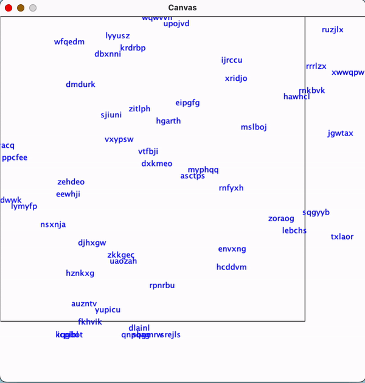

<h1 align="center">ZType Word Game</h1>

Welcome to ZType, a fast-paced typing game where your goal is to destroy words by typing them before they reach the bottom of the screen, otherwise the game ends. Simply run the program to start the game. As words appear at the top and descend, quickly type them using your keyboard and ensure accuracy. Controls are very straightforward; type the words and destroy them before reaching the bottom. The game generates random words for each session but it does offer predictable randomness for testing, ensuring consistent results. Enjoy the game, have fun, and aim for a high score!

<h4>How It's Made</h4>

Tech used: Java

## 🚨 Forking this repo

This code cannot be used for college assignments. I value keeping this code on github as part of my portfolio, but as you all know, <b>plagiarism is bad</b>. I spent a non-negligible amount of effort developing and designing this project and I am proud of it! All I ask is to not claim this effort as your own.

